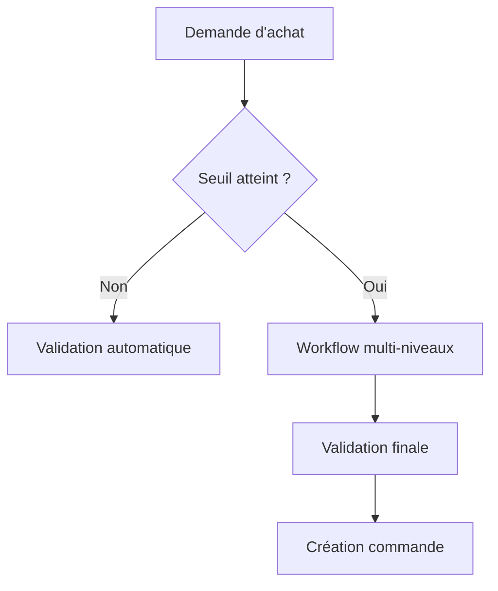
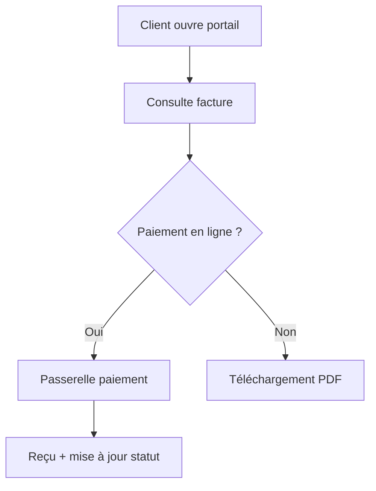
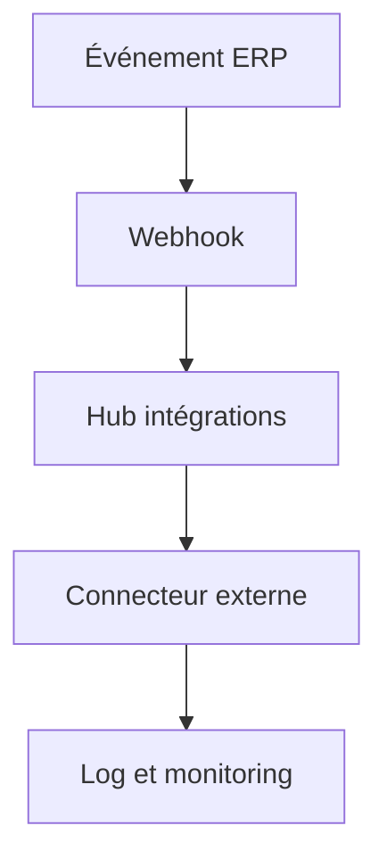
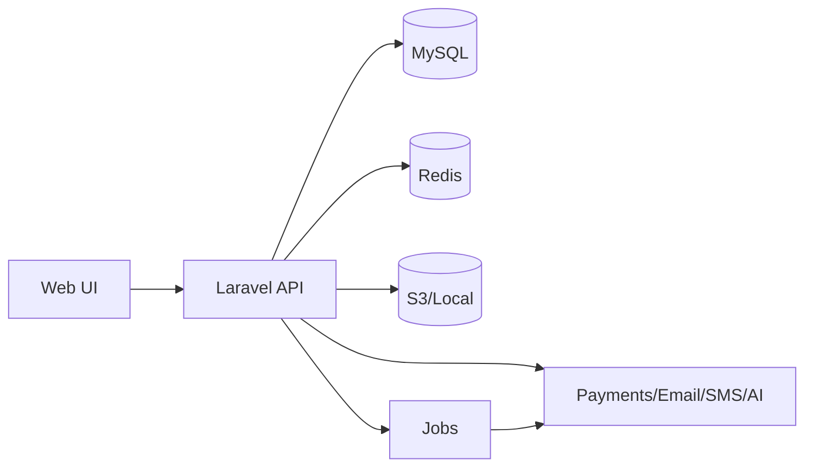

# Spécification fonctionnelle — ERPGo SaaS

## Table des contenus principale

La documentation segmentée par module est disponible dans [docs/README.md](./docs/README.md).

## 1) Analyse préalable

### Objectif métier
Unifier la gestion opérationnelle et financière d’entreprises multi-activités via une plateforme ERP SaaS modulaire, multi-entreprises, avec facturation d’abonnements et paiement client.

### Public cible
PME/ETI, agences, services professionnels, entreprises retail et industrie légère recherchant un ERP modulaire avec CRM, HRM, comptabilité, projets, POS et production.

### Contraintes techniques actuelles
- Laravel 11 en architecture MVC
- Multi-entreprises par cloisonnement sur created_by
- Modules activés par plan d’abonnement
- RBAC basé sur spatie/laravel-permission
- Intégrations natives email, Slack/Telegram/Twilio, Google Calendar, IA, chat interne
- Paiements multi-gateways pour factures et abonnements
- Stockage local/S3/Wasabi avec limites de stockage

### Fonctionnalités existantes et points de friction
Inventaire synthétique des modules existants :
- CRM, HRM, Comptabilité & Ventes, Projets, POS, Stock, Production
- Plans et abonnements, activation de modules, gestion multi-entreprises
- Intégrations et notifications (email, Slack, Telegram, Twilio, Google Calendar)

Points de friction observés par typologie ERP SaaS :
- Pilotage multi-modules fragmenté (KPIs dispersés par module)
- Paramétrage d’approbations et de processus métiers non unifié
- Onboarding de nouvelles entreprises (mapping des données et templates)
- Exploitabilité des données (exports programmés, BI)
- Dépendances d’intégration hétérogènes et absence de hub centralisé

### Benchmarks et standards du secteur
Standards attendus dans les ERP SaaS modernes :
- Tableau de bord unifié et personnalisable
- Journal d’audit et conformité (traçabilité)
- Workflows d’approbation et automatisations
- Intégration iPaaS, webhooks, API, connecteurs
- Portail client et self-service
- Reporting avancé, exports et planification

## 2) Formulation des fonctionnalités proposées

### F01 — Orchestrer des workflows d’approbation multi-niveaux
**Description**  
Mettre en place un moteur d’approbation configurable (multi-niveaux, règles par montant, département, type de document) couvrant achats, factures, notes de frais, congés, budgets. Améliore la conformité et réduit les erreurs de validation.

**Critères d’acceptation**  
- Temps moyen de validation réduit de 30 %  
- 100 % des documents sensibles passent par un workflow  
- Tests : règles par seuil, délégation, escalade, refus/retour commenté

**Pré-requis techniques**  
Modèle d’approbation, moteur de règles, notifications, rôles RBAC, journal d’audit.

**Estimation d’effort**  
Complexité : élevée — Dév : 20-30 j.h — Intégration : 5-8 j.h

**User story**  
En tant que directeur financier, je veux définir des niveaux d’approbation pour les dépenses afin de contrôler les engagements.

---

### F02 — Construire un tableau de bord KPI configurable
**Description**  
Permettre aux utilisateurs de créer un dashboard transversal avec widgets (ventes, trésorerie, pipeline, RH, projets) et filtres par période/entité.

**Critères d’acceptation**  
- 10 widgets disponibles, 3 filtres globaux  
- Temps de chargement < 2 s sur 50k enregistrements  
- Tests : sauvegarde de configurations, permissions, performance

**Pré-requis techniques**  
Agrégations multi-modules, cache, API widgets, permissions.

**Estimation d’effort**  
Complexité : moyenne — Dév : 12-18 j.h — Intégration : 3-5 j.h

**User story**  
En tant que CEO, je veux un dashboard unique pour suivre les KPIs clés par entité.

---

### F03 — Centraliser les intégrations dans un hub iPaaS
**Description**  
Créer un centre d’intégrations avec webhooks, connecteurs Zapier/Make, gestion d’API keys et monitoring des flux.

**Critères d’acceptation**  
- 5 connecteurs prêts à l’emploi  
- Taux d’échec visible et alertes configurables  
- Tests : webhook retry, rate limiting, logs

**Pré-requis techniques**  
Endpoints webhook, gestion des secrets, logs, file d’attente.

**Estimation d’effort**  
Complexité : élevée — Dév : 18-25 j.h — Intégration : 5-8 j.h

**User story**  
En tant que responsable IT, je veux connecter l’ERP aux outils externes sans développement lourd.

---

### F04 — Piloter les budgets et forecasts projet
**Description**  
Ajouter la planification budgétaire, le suivi des coûts réels, et les prévisions de marge par projet.

**Critères d’acceptation**  
- Écart budget/réel visible par phase  
- Alertes si dépassement > 10 %  
- Tests : calculs marge, allocations, multi-devises

**Pré-requis techniques**  
Modèle de budget, liaisons factures/temps, reporting financier.

**Estimation d’effort**  
Complexité : moyenne — Dév : 10-15 j.h — Intégration : 3-5 j.h

**User story**  
En tant que chef de projet, je veux suivre la marge prévisionnelle pour anticiper les dérives.

---

### F05 — Proposer un portail client self-service
**Description**  
Donner aux clients un espace pour consulter factures, paiements, projets, support et documents contractuels.

**Critères d’acceptation**  
- 80 % des demandes de statut résolues sans support  
- Paiement en ligne depuis le portail  
- Tests : permissions client, accès documents, paiement

**Pré-requis techniques**  
Rôles client, vues dédiées, paiement, stockage fichiers.

**Estimation d’effort**  
Complexité : moyenne — Dév : 10-14 j.h — Intégration : 3-4 j.h

**User story**  
En tant que client, je veux suivre mes factures et projets sans solliciter l’équipe.

---

### F06 — Activer un assistant IA orienté métier
**Description**  
Automatiser l’aide contextuelle : résumé de devis, analyse d’écarts budgétaires, suggestions de relance.

**Critères d’acceptation**  
- 60 % d’utilisateurs actifs hebdomadaires sur l’assistant  
- Temps de création de devis réduit de 25 %  
- Tests : prompts sécurisés, traçabilité, quotas

**Pré-requis techniques**  
Accès API IA, modèle de quotas, logs, permissions.

**Estimation d’effort**  
Complexité : moyenne — Dév : 8-12 j.h — Intégration : 2-4 j.h

**User story**  
En tant que commercial, je veux un brouillon de devis rapide basé sur le contexte client.

---

### F07 — Traçer un journal d’audit centralisé
**Description**  
Tracer toutes les actions critiques (création, suppression, exports, paiements) avec recherche et rétention.

**Critères d’acceptation**  
- 100 % des actions sensibles journalisées  
- Export CSV et filtrage par utilisateur  
- Tests : intégrité des logs, accès RBAC, rétention

**Pré-requis techniques**  
Event listeners, stockage logs, interface de recherche.

**Estimation d’effort**  
Complexité : moyenne — Dév : 9-12 j.h — Intégration : 2-3 j.h

**User story**  
En tant qu’auditeur, je veux retracer chaque action critique sur une période.

---

### F08 — Optimiser la gestion d’entrepôt WMS
**Description**  
Ajouter gestion de lots, dates d’expiration, emplacements, codes-barres et inventaires cycliques.

**Critères d’acceptation**  
- Réduction des ruptures de 20 %  
- Inventaire cyclique avec variance < 2 %  
- Tests : scans, picking, FEFO/FIFO

**Pré-requis techniques**  
Modèle de lots, codes-barres, terminaux de scan.

**Estimation d’effort**  
Complexité : élevée — Dév : 20-28 j.h — Intégration : 5-7 j.h

**User story**  
En tant que responsable logistique, je veux contrôler les lots et expirations pour limiter les pertes.

---

### F09 — Planifier les ressources RH et la charge
**Description**  
Ajouter un planning de capacité, gestion de disponibilités et affectations multi-projets.

**Critères d’acceptation**  
- 90 % des affectations visualisées sur un planning  
- Conflits de charge détectés  
- Tests : conflits, temps partiel, congés

**Pré-requis techniques**  
Calendrier, gestion disponibilité, intégration congés.

**Estimation d’effort**  
Complexité : moyenne — Dév : 12-16 j.h — Intégration : 3-5 j.h

**User story**  
En tant que RH, je veux équilibrer la charge par équipe et projet.

---

### F10 — Automatiser les relances et le scoring de risque
**Description**  
Relances automatiques par email/SMS/WhatsApp et scoring client basé sur historique de paiement.

**Critères d’acceptation**  
- DSO réduit de 15 %  
- Relances personnalisées selon segmentation  
- Tests : règles de relance, opt-out, scoring

**Pré-requis techniques**  
Historique paiement, notifications, règles de segmentation.

**Estimation d’effort**  
Complexité : moyenne — Dév : 10-14 j.h — Intégration : 3-4 j.h

**User story**  
En tant que responsable recouvrement, je veux automatiser les relances pour réduire les retards.

---

### F11 — Planifier des exports et rapports programmés
**Description**  
Permettre des exports planifiés (CSV/Excel) et envois récurrents par email.

**Critères d’acceptation**  
- Rapports récurrents configurables par module  
- Temps d’export < 5 min sur 200k lignes  
- Tests : planification, permissions, quotas

**Pré-requis techniques**  
Jobs en file d’attente, stockage temporaire, notifications.

**Estimation d’effort**  
Complexité : moyenne — Dév : 8-12 j.h — Intégration : 2-3 j.h

**User story**  
En tant que contrôleur, je veux recevoir chaque semaine les rapports clés.

---

### F12 — Industrialiser l’onboarding des entreprises
**Description**  
Templates d’entreprise, import assisté, checklists d’activation et données de démo.

**Critères d’acceptation**  
- Temps d’onboarding réduit de 40 %  
- 95 % des imports réussis du premier coup  
- Tests : mapping champs, validation, rollback

**Pré-requis techniques**  
Importers, modèles de templates, validations.

**Estimation d’effort**  
Complexité : moyenne — Dév : 12-16 j.h — Intégration : 3-5 j.h

**User story**  
En tant qu’admin SaaS, je veux créer rapidement une entreprise prête à l’emploi.

## 3) Priorisation Impact/Effort

### Matrice
- **Quick Wins (Impact élevé, Effort moyen)** : F02, F04, F05, F10, F11
- **Investissements stratégiques (Impact élevé, Effort élevé)** : F01, F03, F08
- **Améliorations structurantes (Impact moyen, Effort moyen)** : F07, F09, F12
- **Différenciation (Impact moyen, Effort moyen)** : F06

### Justification de la priorité
L’ordre de priorité reflète :
- Les objectifs business (réduction DSO, adoption, activation rapide)
- La valeur immédiate pour les utilisateurs (dashboard, portail, relances)
- La compatibilité avec la roadmap SaaS (intégrations, approbations)

## 4) Documentation livrable

### Tableau récapitulatif
| ID | Titre | Priorité | Statut |
|---|---|---|---|
| F01 | Orchestrer des workflows d’approbation multi-niveaux | P1 | Proposé |
| F02 | Construire un tableau de bord KPI configurable | P1 | Proposé |
| F03 | Centraliser les intégrations dans un hub iPaaS | P1 | Proposé |
| F04 | Piloter les budgets et forecasts projet | P1 | Proposé |
| F05 | Proposer un portail client self-service | P1 | Proposé |
| F06 | Activer un assistant IA orienté métier | P2 | Proposé |
| F07 | Traçer un journal d’audit centralisé | P2 | Proposé |
| F08 | Optimiser la gestion d’entrepôt WMS | P2 | Proposé |
| F09 | Planifier les ressources RH et la charge | P2 | Proposé |
| F10 | Automatiser les relances et le scoring de risque | P1 | Proposé |
| F11 | Planifier des exports et rapports programmés | P1 | Proposé |
| F12 | Industrialiser l’onboarding des entreprises | P2 | Proposé |

### Diagrammes d’activité (Mermaid)







### Wireframes haute fidélité

**Dashboard KPI**
```
┌───────────────────────────────────────────────┐
│ Filtres: Période | Entité | Module            │
├───────────────────────────────────────────────┤
│ [CA]  [Marge]  [DSO]  [Pipeline]              │
├───────────────────────────────────────────────┤
│ Courbe Ventes           | Top Clients         │
│ (Widget)                | (Widget)            │
├───────────────────────────────────────────────┤
│ Projets à risque        | Ressources RH       │
└───────────────────────────────────────────────┘
```

**Workflow d’approbation**
```
┌───────────────────────────────────────────────┐
│ Document: Dépense #1024                       │
│ Montant: 12 500 €                             │
├───────────────────────────────────────────────┤
│ Niveau 1: Manager    ✅                        │
│ Niveau 2: Finance    ⏳                        │
│ Niveau 3: Direction  ⏳                        │
└───────────────────────────────────────────────┘
```

**Hub intégrations**
```
┌───────────────────────────────────────────────┐
│ Connecteurs: Stripe | Slack | Zapier | S3     │
├───────────────────────────────────────────────┤
│ Flux actifs    | Échecs (24h) | Latence       │
│ Webhooks       | Retry queue  | Logs          │
└───────────────────────────────────────────────┘
```

## 5) Validation et itération

### Processus de validation
- Revue des propositions avec parties prenantes (produit, finance, RH, IT)
- Analyse ROI et ajustements budgétaires
- Validation finale et gel des spécifications

### Version finale
La version finale sera validée par le commanditaire et servira de référentiel unique pour la conception et le développement.

## 6) Spécification technique détaillée

### Authentification & Sessions
**Catégorie** : Sécurité  
**Priorité** : Must  
**Description courte** : Authentifier les utilisateurs et sécuriser les sessions.  
**Valeur business** : Réduit le risque d’accès non autorisé.

**Spécifications fonctionnelles**
- User stories principales  
  - En tant qu’utilisateur, je me connecte avec email/mot de passe.  
  - En tant qu’utilisateur, je réinitialise mon mot de passe.  
  - En tant qu’admin, j’impose la vérification email.
- Critères d’acceptation  
  - Connexion avec throttling et blocage après N échecs.  
  - Réinitialisation via token expirant.  
  - Sessions invalidées lors du logout.

**Spécifications techniques**
- Architecture & pattern à utiliser : Laravel Auth + middleware  
- Schéma de données : users(id, email, password, email_verified_at, created_by, type)  
- APIs exposées : POST /login, POST /forgot-password, POST /logout  
- Événements : UserLoggedIn, UserLoggedOut  
- Intégrations externes : none  
- Considérations multi-tenant : creatorId() pour contexte  
- Sécurité & conformité associées : hash bcrypt, CSRF, throttle  
- Gestion des erreurs & rollback : messages neutres, pas de détails sur existence compte

**Implémentation recommandée**
- Tech stack précise : Laravel 11.44.1, PHP 8.2  
- Code structure : app/Http/Controllers/Auth  
- Exemple de code clé  
  ```typescript
  async function login(email: string, password: string) {
    const user = await Users.findByEmail(email)
    if (!user || !user.verifyPassword(password)) throw new Error("unauthorized")
    return Sessions.create(user.id)
  }
  ```
- Tests à écrire : unitaires hash, intégration login, E2E reset password

**Monitoring & KPIs**
- Métriques à tracker : taux d’échec login, durée session  
- Alertes à configurer : spike d’échecs login  
- Dashboards Grafana à créer : Security Overview

**Estimation d’effort**
- Story points : 5  
- Homme-jours : 4 (dev) + 1 (QA)  
- Dépendances bloquantes : none

---

### Multi-entreprises (Tenancy)
**Catégorie** : Architecture  
**Priorité** : Must  
**Description courte** : Cloisonner les données par entreprise.  
**Valeur business** : Garantit l’isolation et la conformité.

**Spécifications fonctionnelles**
- User stories principales  
  - En tant qu’utilisateur, je ne vois que les données de mon entreprise.  
  - En tant qu’admin SaaS, je crée un tenant.  
  - En tant que support, j’impersonate un client.
- Critères d’acceptation  
  - Toutes les requêtes filtrées par created_by.  
  - Impersonation tracée.  
  - Aucun accès cross-tenant.

**Spécifications techniques**
- Architecture & pattern à utiliser : Global scopes + creatorId()  
- Schéma de données : ajout created_by sur tables métier  
- APIs exposées : POST /api/tenants  
- Événements : TenantCreated  
- Intégrations externes : none  
- Considérations multi-tenant : index (created_by, id)  
- Sécurité & conformité associées : policies par tenant  
- Gestion des erreurs & rollback : fallback creatorId si contexte manquant

**Implémentation recommandée**
- Tech stack précise : Laravel 11.44.1  
- Code structure : app/Models/User.php, scopes sur modèles  
- Exemple de code clé  
  ```typescript
  function scopeTenant(query, creatorId) {
    return query.where("created_by", creatorId)
  }
  ```
- Tests à écrire : unitaires scope, intégration permissions, E2E impersonation

**Monitoring & KPIs**
- Métriques à tracker : tentatives cross-tenant  
- Alertes à configurer : accès interdit répété  
- Dashboards Grafana à créer : Tenant Isolation

**Estimation d’effort**
- Story points : 8  
- Homme-jours : 6 + 2  
- Dépendances bloquantes : RBAC

---

### Rôles & Permissions (RBAC)
**Catégorie** : Sécurité  
**Priorité** : Must  
**Description courte** : Contrôler l’accès aux actions et données.  
**Valeur business** : Réduit les erreurs et fuites de données.

**Spécifications fonctionnelles**
- User stories principales  
  - En tant qu’admin, je crée un rôle avec permissions.  
  - En tant que manager, j’assigne un rôle à un utilisateur.  
  - En tant qu’auditeur, je vérifie les accès.
- Critères d’acceptation  
  - Permissions vérifiées sur chaque action sensible.  
  - Traçabilité des changements de rôles.  
  - Export des rôles.

**Spécifications techniques**
- Architecture & pattern à utiliser : spatie/laravel-permission  
- Schéma de données : roles, permissions, model_has_roles, role_has_permissions  
- APIs exposées : POST /api/roles, POST /api/permissions  
- Événements : RoleAssigned, PermissionUpdated  
- Intégrations externes : none  
- Considérations multi-tenant : rôles par tenant  
- Sécurité & conformité associées : least privilege  
- Gestion des erreurs & rollback : transaction sur assignations multiples

**Implémentation recommandée**
- Tech stack précise : spatie/laravel-permission 6.9  
- Code structure : RoleController, PermissionController  
- Exemple de code clé  
  ```typescript
  async function assignRole(userId, roleId) {
    await RoleAssignments.create({ userId, roleId })
  }
  ```
- Tests à écrire : unitaires policies, intégration assignation

**Monitoring & KPIs**
- Métriques à tracker : changements de rôles  
- Alertes à configurer : ajout rôle admin  
- Dashboards Grafana à créer : RBAC Changes

**Estimation d’effort**
- Story points : 5  
- Homme-jours : 4 + 1  
- Dépendances bloquantes : Auth

---

### Paramètres système & Branding
**Catégorie** : Configuration  
**Priorité** : Must  
**Description courte** : Gérer la configuration par tenant.  
**Valeur business** : Permet la personnalisation et l’autonomie.

**Spécifications fonctionnelles**
- User stories principales  
  - En tant qu’admin, je configure SMTP.  
  - En tant qu’admin, je change logo/couleurs.  
  - En tant que DSI, je active/désactive la landing page.
- Critères d’acceptation  
  - Settings persistés par tenant.  
  - Modifications visibles en < 1 min.  
  - Validation des champs critiques.

**Spécifications techniques**
- Architecture & pattern à utiliser : Utility::settings + cache  
- Schéma de données : settings(id, name, value, created_by)  
- APIs exposées : PUT /api/settings  
- Événements : SettingUpdated  
- Intégrations externes : none  
- Considérations multi-tenant : settings par created_by  
- Sécurité & conformité associées : validation stricte  
- Gestion des erreurs & rollback : rollback si upload logo échoue

**Implémentation recommandée**
- Tech stack précise : Laravel 11.44.1  
- Code structure : SystemController, Utility.php  
- Exemple de code clé  
  ```typescript
  async function updateSetting(name, value, tenantId) {
    return Settings.upsert({ name, value, created_by: tenantId })
  }
  ```
- Tests à écrire : unitaires validation, intégration SMTP

**Monitoring & KPIs**
- Métriques à tracker : changements settings  
- Alertes à configurer : SMTP invalides  
- Dashboards Grafana à créer : Settings Activity

**Estimation d’effort**
- Story points : 5  
- Homme-jours : 4 + 1  
- Dépendances bloquantes : Auth

---

### Plans & Abonnements
**Catégorie** : SaaS  
**Priorité** : Must  
**Description courte** : Monétiser et limiter les fonctionnalités.  
**Valeur business** : Génère le revenu récurrent.

**Spécifications fonctionnelles**
- User stories principales  
  - En tant qu’admin, je crée un plan et ses modules.  
  - En tant qu’entreprise, je change de plan.  
  - En tant que finance, je vois les renouvellements.
- Critères d’acceptation  
  - Limites users et storage appliquées.  
  - Modules visibles selon plan.  
  - Downgrade bloque si dépassement.

**Spécifications techniques**
- Architecture & pattern à utiliser : PlanService + gating User::show_*  
- Schéma de données : plans, plan_features, orders, subscriptions  
- APIs exposées : POST /api/plans, POST /api/subscriptions  
- Événements : PlanUpgraded, PlanDowngraded  
- Intégrations externes : gateways paiement  
- Considérations multi-tenant : plan par tenant  
- Sécurité & conformité associées : RBAC admin  
- Gestion des erreurs & rollback : transaction sur upgrade

**Implémentation recommandée**
- Tech stack précise : Laravel 11.44.1  
- Code structure : PlanController, User.php  
- Exemple de code clé  
  ```typescript
  function canAccessModule(user, module) {
    return user.plan?.features?.includes(module)
  }
  ```
- Tests à écrire : unitaires gating, intégration upgrade

**Monitoring & KPIs**
- Métriques à tracker : MRR, churn  
- Alertes à configurer : échecs renouvellement  
- Dashboards Grafana à créer : SaaS Revenue

**Estimation d’effort**
- Story points : 8  
- Homme-jours : 6 + 2  
- Dépendances bloquantes : paiements

---

### CRM
**Catégorie** : Business  
**Priorité** : Must  
**Description courte** : Piloter la prospection et le pipeline commercial.  
**Valeur business** : Augmente les conversions et prévisions.

**Spécifications fonctionnelles**
- User stories principales  
  - En tant que commercial, je crée un lead.  
  - En tant que manager, je visualise le pipeline.  
  - En tant qu’équipe, je convertis un lead en deal.
- Critères d’acceptation  
  - Pipeline configurable par étapes.  
  - Conversion lead→deal conserve l’historique.  
  - KPIs pipeline calculés.

**Spécifications techniques**
- Architecture & pattern à utiliser : MVC + CRMService  
- Schéma de données : leads, deals, pipelines, stages  
- APIs exposées : POST /api/crm/leads, POST /api/crm/deals  
- Événements : LeadCreated, DealStageChanged  
- Intégrations externes : email, calendrier  
- Considérations multi-tenant : created_by + index  
- Sécurité & conformité associées : RBAC par module  
- Gestion des erreurs & rollback : transaction sur conversion

**Implémentation recommandée**
- Tech stack précise : Laravel 11.44.1  
- Code structure : LeadController, DealController  
- Exemple de code clé  
  ```typescript
  async function convertLeadToDeal(leadId, payload) {
    const deal = await Deals.create({ ...payload, lead_id: leadId })
    await Leads.update(leadId, { status: "converted" })
    return deal
  }
  ```
- Tests à écrire : unitaires conversion, E2E pipeline

**Monitoring & KPIs**
- Métriques à tracker : taux conversion, valeur pipeline  
- Alertes à configurer : chute conversion  
- Dashboards Grafana à créer : CRM Overview

**Estimation d’effort**
- Story points : 13  
- Homme-jours : 12 + 3  
- Dépendances bloquantes : RBAC

---

### HRM
**Catégorie** : Business  
**Priorité** : Must  
**Description courte** : Gérer employés, présence, congés, paie.  
**Valeur business** : Réduit les erreurs RH et améliore la conformité.

**Spécifications fonctionnelles**
- User stories principales  
  - En tant que RH, je crée un employé.  
  - En tant que manager, je valide un congé.  
  - En tant que RH, je génère une paie.
- Critères d’acceptation  
  - Workflow congés validé.  
  - Paie calculée avec règles.  
  - Présence exportable.

**Spécifications techniques**
- Architecture & pattern à utiliser : HRMService + PayrollService  
- Schéma de données : employees, attendances, leaves, payslips  
- APIs exposées : POST /api/hrm/leaves, POST /api/hrm/payslips  
- Événements : LeaveApproved, PayslipGenerated  
- Intégrations externes : email, SMS  
- Considérations multi-tenant : created_by  
- Sécurité & conformité associées : accès salarié limité  
- Gestion des erreurs & rollback : transaction paie

**Implémentation recommandée**
- Tech stack précise : Laravel 11.44.1  
- Code structure : EmployeeController, PayrollService  
- Exemple de code clé  
  ```typescript
  function computeNetPay(gross, allowances, deductions) {
    return gross + allowances - deductions
  }
  ```
- Tests à écrire : unitaires paie, intégration congés

**Monitoring & KPIs**
- Métriques à tracker : taux absentéisme  
- Alertes à configurer : paie non générée  
- Dashboards Grafana à créer : HRM Overview

**Estimation d’effort**
- Story points : 21  
- Homme-jours : 18 + 4  
- Dépendances bloquantes : RBAC

---

### Comptabilité & Ventes
**Catégorie** : Finance  
**Priorité** : Must  
**Description courte** : Devis, factures, achats, dépenses, journaux.  
**Valeur business** : Accélère le cashflow et la conformité.

**Spécifications fonctionnelles**
- User stories principales  
  - En tant que commercial, je crée un devis.  
  - En tant que comptable, je saisis une dépense.  
  - En tant que finance, je réconcilie un paiement.
- Critères d’acceptation  
  - Devis converti en facture.  
  - Paiement met à jour le statut.  
  - Journaux équilibrés.

**Spécifications techniques**
- Architecture & pattern à utiliser : InvoiceService + AccountingService  
- Schéma de données : quotations, invoices, invoice_items, bills, expenses, journal_entries  
- APIs exposées : POST /api/invoices, POST /api/bills  
- Événements : InvoiceCreated, PaymentReceived  
- Intégrations externes : Stripe, PayPal, Mollie, etc.  
- Considérations multi-tenant : created_by + index invoice_number  
- Sécurité & conformité associées : audit log, RBAC  
- Gestion des erreurs & rollback : transaction facture+items

**Implémentation recommandée**
- Tech stack précise : Laravel 11.44.1, phpoffice/phpspreadsheet  
- Code structure : InvoiceController, JournalEntryController  
- Exemple de code clé  
  ```typescript
  function applyPayment(invoice, amount) {
    const paid = invoice.paid + amount
    return { paid, status: paid >= invoice.total ? "paid" : "partial" }
  }
  ```
- Tests à écrire : unitaires taxes, intégration paiement

**Monitoring & KPIs**
- Métriques à tracker : DSO, taux impayés  
- Alertes à configurer : facture échue > 15j  
- Dashboards Grafana à créer : Finance Cashflow

**Estimation d’effort**
- Story points : 20  
- Homme-jours : 16 + 4  
- Dépendances bloquantes : paiements

---

### Projets & Temps
**Catégorie** : Delivery  
**Priorité** : Must  
**Description courte** : Suivre l’avancement et la charge projet.  
**Valeur business** : Optimise la rentabilité et la planification.

**Spécifications fonctionnelles**
- User stories principales  
  - En tant que chef de projet, je crée un projet.  
  - En tant que consultant, je saisis mon temps.  
  - En tant que manager, je mesure l’avancement.
- Critères d’acceptation  
  - Avancement basé sur tâches.  
  - Timesheets validés.  
  - Export par projet.

**Spécifications techniques**
- Architecture & pattern à utiliser : ProjectService + ProgressService  
- Schéma de données : projects, project_tasks, task_stages, timesheets  
- APIs exposées : POST /api/projects, POST /api/timesheets  
- Événements : TaskCompleted, TimesheetApproved  
- Intégrations externes : Google Calendar  
- Considérations multi-tenant : created_by  
- Sécurité & conformité associées : RBAC  
- Gestion des erreurs & rollback : transaction assignation

**Implémentation recommandée**
- Tech stack précise : Laravel 11.44.1  
- Code structure : ProjectController, TimesheetController  
- Exemple de code clé  
  ```typescript
  function computeProgress(done, total) {
    return total === 0 ? 0 : Math.round((done / total) * 100)
  }
  ```
- Tests à écrire : unitaires progression, intégration timesheet

**Monitoring & KPIs**
- Métriques à tracker : charge vs capacité  
- Alertes à configurer : retard > 10%  
- Dashboards Grafana à créer : Project Delivery

**Estimation d’effort**
- Story points : 13  
- Homme-jours : 10 + 3  
- Dépendances bloquantes : HRM

---

### POS
**Catégorie** : Retail  
**Priorité** : Must  
**Description courte** : Encaissement rapide et synchronisé stock.  
**Valeur business** : Augmente le volume de vente.

**Spécifications fonctionnelles**
- User stories principales  
  - En tant que vendeur, je scanne un produit.  
  - En tant que manager, je clôture la caisse.  
  - En tant que back-office, je vois les ventes.
- Critères d’acceptation  
  - Ticket généré avec taxes/remises.  
  - Stock décrémenté en temps réel.  
  - Remboursement tracé.

**Spécifications techniques**
- Architecture & pattern à utiliser : POSService + StockService  
- Schéma de données : pos_sales, pos_items, cash_registers  
- APIs exposées : POST /api/pos/sales  
- Événements : PosSaleCompleted  
- Intégrations externes : barcode, imprimante  
- Considérations multi-tenant : created_by  
- Sécurité & conformité associées : rôle caisse dédié  
- Gestion des erreurs & rollback : rollback si stock insuffisant

**Implémentation recommandée**
- Tech stack précise : Laravel 11.44.1, milon/barcode  
- Code structure : PosController, CheckoutService  
- Exemple de code clé  
  ```typescript
  function canSell(stock, qty) {
    return stock >= qty
  }
  ```
- Tests à écrire : intégration stock, E2E encaissement

**Monitoring & KPIs**
- Métriques à tracker : temps encaissement  
- Alertes à configurer : stock négatif  
- Dashboards Grafana à créer : POS Performance

**Estimation d’effort**
- Story points : 8  
- Homme-jours : 7 + 2  
- Dépendances bloquantes : Stock

---

### Stock & WMS (base)
**Catégorie** : Supply Chain  
**Priorité** : Must  
**Description courte** : Suivi stock par entrepôt.  
**Valeur business** : Réduit ruptures et erreurs.

**Spécifications fonctionnelles**
- User stories principales  
  - En tant que logisticien, je gère les stocks.  
  - En tant que vendeur, je vois la disponibilité.  
  - En tant qu’admin, je fais un inventaire.
- Critères d’acceptation  
  - Mouvements stock journalisés.  
  - Disponibilité par entrepôt.  
  - Inventaire exportable.

**Spécifications techniques**
- Architecture & pattern à utiliser : StockService  
- Schéma de données : warehouses, product_stocks, stock_movements  
- APIs exposées : POST /api/stock/movements  
- Événements : StockAdjusted  
- Intégrations externes : barcode  
- Considérations multi-tenant : created_by  
- Sécurité & conformité associées : RBAC stock  
- Gestion des erreurs & rollback : compensation sur mouvement invalidé

**Implémentation recommandée**
- Tech stack précise : Laravel 11.44.1  
- Code structure : WarehouseController, ProductStockController  
- Exemple de code clé  
  ```typescript
  function moveStock(from, to, qty) {
    if (from < qty) throw new Error("insufficient")
    return { from: from - qty, to: to + qty }
  }
  ```
- Tests à écrire : unitaires mouvements, intégration inventaire

**Monitoring & KPIs**
- Métriques à tracker : taux rupture, variance inventaire  
- Alertes à configurer : seuil mini  
- Dashboards Grafana à créer : Stock Health

**Estimation d’effort**
- Story points : 8  
- Homme-jours : 7 + 2  
- Dépendances bloquantes : POS

---

### Production
**Catégorie** : Industrie  
**Priorité** : Must  
**Description courte** : Gérer BOM et ordres de fabrication.  
**Valeur business** : Maîtrise coût et délai.

**Spécifications fonctionnelles**
- User stories principales  
  - En tant que responsable, je crée un BOM.  
  - En tant qu’atelier, je lance un ordre.  
  - En tant que manager, je mesure le rendement.
- Critères d’acceptation  
  - BOM versionné.  
  - Consommation stock automatique.  
  - Rendement calculé par ordre.

**Spécifications techniques**
- Architecture & pattern à utiliser : ProductionService  
- Schéma de données : boms, bom_items, production_orders, work_centers  
- APIs exposées : POST /api/production/orders  
- Événements : ProductionOrderStarted, ProductionOrderCompleted  
- Intégrations externes : WMS  
- Considérations multi-tenant : created_by  
- Sécurité & conformité associées : RBAC production  
- Gestion des erreurs & rollback : rollback si stock insuffisant

**Implémentation recommandée**
- Tech stack précise : Laravel 11.44.1  
- Code structure : ProductionOrderController  
- Exemple de code clé  
  ```typescript
  function computeYield(output, input) {
    return input === 0 ? 0 : Math.round((output / input) * 100)
  }
  ```
- Tests à écrire : intégration stock, E2E ordre complet

**Monitoring & KPIs**
- Métriques à tracker : OEE, taux rebut  
- Alertes à configurer : ordre en retard  
- Dashboards Grafana à créer : Production KPIs

**Estimation d’effort**
- Story points : 13  
- Homme-jours : 12 + 3  
- Dépendances bloquantes : Stock

---

### Notifications & Intégrations
**Catégorie** : Intégrations  
**Priorité** : Must  
**Description courte** : Notifier via email/Slack/Telegram/SMS.  
**Valeur business** : Augmente la réactivité.

**Spécifications fonctionnelles**
- User stories principales  
  - En tant qu’admin, je configure les canaux.  
  - En tant que manager, je reçois des alertes.  
  - En tant qu’utilisateur, je choisis mes préférences.
- Critères d’acceptation  
  - Notifications envoyées selon préférences.  
  - Retry automatique en cas d’échec.  
  - Logs consultables.

**Spécifications techniques**
- Architecture & pattern à utiliser : Jobs + NotificationService  
- Schéma de données : notification_settings, notification_logs  
- APIs exposées : POST /api/notifications/test  
- Événements : NotificationDispatched, NotificationFailed  
- Intégrations externes : Slack, Telegram, Twilio  
- Considérations multi-tenant : config par tenant  
- Sécurité & conformité associées : chiffrement secrets  
- Gestion des erreurs & rollback : retry + DLQ

**Implémentation recommandée**
- Tech stack précise : Laravel 11.44.1  
- Code structure : Utility.php, Jobs  
- Exemple de code clé  
  ```typescript
  async function sendNotification(channel, payload) {
    return Channels[channel].send(payload)
  }
  ```
- Tests à écrire : intégration dispatch, E2E notification

**Monitoring & KPIs**
- Métriques à tracker : taux succès  
- Alertes à configurer : échecs > 5%  
- Dashboards Grafana à créer : Notifications Health

**Estimation d’effort**
- Story points : 5  
- Homme-jours : 4 + 1  
- Dépendances bloquantes : queue

---

### Paiements (Factures & Abonnements)
**Catégorie** : Finance  
**Priorité** : Must  
**Description courte** : Encaisser et réconcilier paiements.  
**Valeur business** : Sécurise le revenu.

**Spécifications fonctionnelles**
- User stories principales  
  - En tant que client, je paie une facture.  
  - En tant qu’entreprise, je paye un plan.  
  - En tant que finance, je vois le statut.
- Critères d’acceptation  
  - Webhooks valident l’état.  
  - Statut facture mis à jour.  
  - Historique consultable.

**Spécifications techniques**
- Architecture & pattern à utiliser : GatewayControllers + Webhooks  
- Schéma de données : payments, payment_logs, orders  
- APIs exposées : POST /api/payments, POST /webhooks/stripe  
- Événements : PaymentSucceeded, PaymentFailed  
- Intégrations externes : Stripe, PayPal, Mollie, Paystack, etc.  
- Considérations multi-tenant : created_by  
- Sécurité & conformité associées : signature webhook, idempotency  
- Gestion des erreurs & rollback : retry webhook, compensation

**Implémentation recommandée**
- Tech stack précise : stripe/stripe-php 15.7, srmklive/paypal 3.0  
- Code structure : StripePaymentController, PaypalController  
- Exemple de code clé  
  ```typescript
  async function handleWebhook(event) {
    if (event.type === "payment_succeeded") return Payments.confirm(event.id)
  }
  ```
- Tests à écrire : intégration webhooks, E2E paiement

**Monitoring & KPIs**
- Métriques à tracker : taux succès, temps confirmation  
- Alertes à configurer : échec webhook  
- Dashboards Grafana à créer : Payments

**Estimation d’effort**
- Story points : 13  
- Homme-jours : 12 + 3  
- Dépendances bloquantes : gateways

---

### Stockage fichiers & Limites
**Catégorie** : Infrastructure  
**Priorité** : Must  
**Description courte** : Gérer uploads et quotas.  
**Valeur business** : Contrôle coûts et sécurité.

**Spécifications fonctionnelles**
- User stories principales  
  - En tant qu’utilisateur, je téléverse un document.  
  - En tant qu’admin, je configure S3.  
  - En tant que finance, je vois l’usage.
- Critères d’acceptation  
  - Quota appliqué par tenant.  
  - Téléchargement sécurisé.  
  - Suppression libère l’espace.

**Spécifications techniques**
- Architecture & pattern à utiliser : StorageService + Flysystem  
- Schéma de données : files, storage_usage  
- APIs exposées : POST /api/files, GET /storage/uploads/{path}  
- Événements : FileUploaded, QuotaExceeded  
- Intégrations externes : S3/Wasabi  
- Considérations multi-tenant : quota par created_by  
- Sécurité & conformité associées : signed URLs  
- Gestion des erreurs & rollback : rollback upload partiel

**Implémentation recommandée**
- Tech stack précise : league/flysystem-aws-s3-v3 3.28  
- Code structure : Utility.php  
- Exemple de code clé  
  ```typescript
  async function ensureQuota(used, add, limit) {
    if (used + add > limit) throw new Error("quota_exceeded")
  }
  ```
- Tests à écrire : intégration upload, E2E quota

**Monitoring & KPIs**
- Métriques à tracker : stockage utilisé  
- Alertes à configurer : > 90% quota  
- Dashboards Grafana à créer : Storage Usage

**Estimation d’effort**
- Story points : 5  
- Homme-jours : 4 + 1  
- Dépendances bloquantes : storage externe

---

### Chat interne
**Catégorie** : Collaboration  
**Priorité** : Could  
**Description courte** : Messagerie interne entre utilisateurs.  
**Valeur business** : Accélère la communication.

**Spécifications fonctionnelles**
- User stories principales  
  - En tant qu’utilisateur, j’envoie un message.  
  - En tant qu’utilisateur, je partage un fichier.  
  - En tant qu’admin, je modère un fil.
- Critères d’acceptation  
  - Messages instantanés.  
  - Fichiers attachés avec limites.  
  - Historique conservé.

**Spécifications techniques**
- Architecture & pattern à utiliser : Chatify package  
- Schéma de données : ch_messages, ch_favorites  
- APIs exposées : endpoints Chatify  
- Événements : MessageSent  
- Intégrations externes : none  
- Considérations multi-tenant : created_by  
- Sécurité & conformité associées : permissions de conversation  
- Gestion des erreurs & rollback : retry upload

**Implémentation recommandée**
- Tech stack précise : munafio/chatify 1.5  
- Code structure : package Chatify  
- Exemple de code clé  
  ```typescript
  async function sendMessage(toId, body) {
    return Messages.create({ to_id: toId, body })
  }
  ```
- Tests à écrire : E2E chat, upload

**Monitoring & KPIs**
- Métriques à tracker : messages/jour  
- Alertes à configurer : échecs upload  
- Dashboards Grafana à créer : Chat Activity

**Estimation d’effort**
- Story points : 3  
- Homme-jours : 2 + 1  
- Dépendances bloquantes : stockage

---

### F01 — Workflows d’approbation multi-niveaux
**Catégorie** : Gouvernance  
**Priorité** : Must  
**Description courte** : Orchestrer validations multi-niveaux.  
**Valeur business** : Réduit les risques de dépenses.

**Spécifications fonctionnelles**
- User stories principales  
  - En tant que DAF, je configure des niveaux.  
  - En tant que manager, je délègue une approbation.  
  - En tant qu’admin, je trace les décisions.
- Critères d’acceptation  
  - Règles par montant, type, département.  
  - Escalade si délai dépassé.  
  - Refus avec commentaire obligatoire.

**Spécifications techniques**
- Architecture & pattern à utiliser : ApprovalEngine + Rules  
- Schéma de données : approval_flows, approval_steps, approval_requests, approval_actions  
- APIs exposées : POST /api/approvals/submit, POST /api/approvals/{id}/action  
- Événements : ApprovalRequested, ApprovalApproved, ApprovalRejected  
- Intégrations externes : notifications  
- Considérations multi-tenant : flows par tenant  
- Sécurité & conformité associées : RBAC + audit log  
- Gestion des erreurs & rollback : transaction sur action

**Implémentation recommandée**
- Tech stack précise : Laravel 11.44.1, Redis  
- Code structure : app/Services/Approvals  
- Exemple de code clé  
  ```typescript
  function nextStep(flow, context) {
    return flow.steps.find(step => step.rule.matches(context))
  }
  ```
- Tests à écrire : unitaires règles, intégration escalade

**Monitoring & KPIs**
- Métriques à tracker : délai moyen approbation  
- Alertes à configurer : approbation > SLA  
- Dashboards Grafana à créer : Approvals

**Estimation d’effort**
- Story points : 21  
- Homme-jours : 22 + 6  
- Dépendances bloquantes : audit log

---

### F02 — Tableau de bord KPI configurable
**Catégorie** : Analytics  
**Priorité** : Must  
**Description courte** : Dashboard multi-modules personnalisable.  
**Valeur business** : Accélère la prise de décision.

**Spécifications fonctionnelles**
- User stories principales  
  - En tant que dirigeant, je configure mes KPIs.  
  - En tant que manager, je filtre par période.  
  - En tant qu’admin, je partage un template.
- Critères d’acceptation  
  - Widgets configurables et persistés.  
  - Temps de chargement < 2 s.  
  - Export PDF possible.

**Spécifications techniques**
- Architecture & pattern à utiliser : KPIService + cache  
- Schéma de données : dashboards, dashboard_widgets, widget_filters  
- APIs exposées : GET /api/kpi/widgets, POST /api/kpi/dashboards  
- Événements : WidgetConfigured  
- Intégrations externes : Redis, spatie/browsershot  
- Considérations multi-tenant : dashboards par tenant  
- Sécurité & conformité associées : RBAC  
- Gestion des erreurs & rollback : fallback cache stale

**Implémentation recommandée**
- Tech stack précise : Redis, spatie/browsershot 5.0  
- Code structure : app/Services/Kpi  
- Exemple de code clé  
  ```typescript
  async function computeWidget(metric, filters) {
    return Metrics.aggregate(metric, filters)
  }
  ```
- Tests à écrire : unitaires agrégations, intégration cache

**Monitoring & KPIs**
- Métriques à tracker : latence widgets  
- Alertes à configurer : latence > 2s  
- Dashboards Grafana à créer : KPI Performance

**Estimation d’effort**
- Story points : 13  
- Homme-jours : 12 + 3  
- Dépendances bloquantes : modèles KPI

---

### F03 — Hub iPaaS
**Catégorie** : Intégrations  
**Priorité** : Must  
**Description courte** : Centraliser connecteurs et webhooks.  
**Valeur business** : Réduit le coût d’intégration.

**Spécifications fonctionnelles**
- User stories principales  
  - En tant qu’admin, je configure un connecteur.  
  - En tant que dev, je consomme un webhook standard.  
  - En tant que support, je rejoue un flux.
- Critères d’acceptation  
  - Catalogue de connecteurs activables.  
  - Logs d’exécution consultables.  
  - Rejouer un événement.

**Spécifications techniques**
- Architecture & pattern à utiliser : Event Bus + Dispatcher  
- Schéma de données : integration_connectors, integration_runs, integration_logs  
- APIs exposées : POST /api/integrations/{id}/trigger  
- Événements : IntegrationTriggered, IntegrationFailed  
- Intégrations externes : Zapier, Make, Webhooks  
- Considérations multi-tenant : connecteurs par tenant  
- Sécurité & conformité associées : signatures HMAC  
- Gestion des erreurs & rollback : retry + DLQ

**Implémentation recommandée**
- Tech stack précise : Laravel 11.44.1, Redis  
- Code structure : app/Services/Integrations  
- Exemple de code clé  
  ```typescript
  async function dispatchEvent(event) {
    return Integrations.runAll(event)
  }
  ```
- Tests à écrire : intégration webhook, chaos retry

**Monitoring & KPIs**
- Métriques à tracker : taux succès intégrations  
- Alertes à configurer : échecs > 5%  
- Dashboards Grafana à créer : Integration Hub

**Estimation d’effort**
- Story points : 21  
- Homme-jours : 20 + 6  
- Dépendances bloquantes : event bus

---

### F04 — Budgets & Forecasts Projet
**Catégorie** : Finance/Projet  
**Priorité** : Must  
**Description courte** : Budgets, suivi réel, marge prévisionnelle.  
**Valeur business** : Réduit les dérives projet.

**Spécifications fonctionnelles**
- User stories principales  
  - En tant que chef de projet, je définis un budget.  
  - En tant que finance, je vois l’écart budget/réel.  
  - En tant que direction, je prévois la marge.
- Critères d’acceptation  
  - Alerte si dépassement > 10 %.  
  - Budgets par phase.  
  - Multi-devises supportées.

**Spécifications techniques**
- Architecture & pattern à utiliser : BudgetService + Reporting  
- Schéma de données : project_budgets, budget_lines, cost_actuals  
- APIs exposées : POST /api/projects/{id}/budget  
- Événements : BudgetExceeded  
- Intégrations externes : compta  
- Considérations multi-tenant : created_by  
- Sécurité & conformité associées : RBAC  
- Gestion des erreurs & rollback : transaction calculs

**Implémentation recommandée**
- Tech stack précise : Laravel 11.44.1  
- Code structure : app/Services/Project/BudgetService  
- Exemple de code clé  
  ```typescript
  function variance(actual, budget) {
    return budget === 0 ? 0 : ((actual - budget) / budget) * 100
  }
  ```
- Tests à écrire : unitaires calculs, intégration alertes

**Monitoring & KPIs**
- Métriques à tracker : variance budget, marge  
- Alertes à configurer : dépassement budget  
- Dashboards Grafana à créer : Project Finance

**Estimation d’effort**
- Story points : 13  
- Homme-jours : 12 + 3  
- Dépendances bloquantes : timesheets, factures

---

### F05 — Portail client self-service
**Catégorie** : Expérience client  
**Priorité** : Must  
**Description courte** : Accès client aux factures, projets, support.  
**Valeur business** : Réduit le coût support.

**Spécifications fonctionnelles**
- User stories principales  
  - En tant que client, je consulte mes factures.  
  - En tant que client, je paye en ligne.  
  - En tant que client, je télécharge mes documents.
- Critères d’acceptation  
  - Accès restreint aux données client.  
  - Paiement en ligne disponible.  
  - Documents signés et téléchargeables.

**Spécifications techniques**
- Architecture & pattern à utiliser : PortalController + Policies  
- Schéma de données : customer_portal_settings  
- APIs exposées : GET /api/portal/invoices  
- Événements : PortalLogin  
- Intégrations externes : paiement  
- Considérations multi-tenant : isolation client  
- Sécurité & conformité associées : scopes client  
- Gestion des erreurs & rollback : session expirée gérée

**Implémentation recommandée**
- Tech stack précise : Laravel 11.44.1  
- Code structure : app/Http/Controllers/Portal  
- Exemple de code clé  
  ```typescript
  function canAccessInvoice(customerId, invoice) {
    return invoice.customer_id === customerId
  }
  ```
- Tests à écrire : E2E portail, permissions

**Monitoring & KPIs**
- Métriques à tracker : taux usage portail  
- Alertes à configurer : échec login massif  
- Dashboards Grafana à créer : Portal Engagement

**Estimation d’effort**
- Story points : 13  
- Homme-jours : 10 + 3  
- Dépendances bloquantes : paiements

---

### F06 — Assistant IA orienté métier
**Catégorie** : Innovation  
**Priorité** : Should  
**Description courte** : Assistance contextuelle et analytique.  
**Valeur business** : Augmente la productivité.

**Spécifications fonctionnelles**
- User stories principales  
  - En tant que commercial, je génère un devis brouillon.  
  - En tant que finance, je demande une analyse d’écarts.  
  - En tant qu’admin, je fixe des quotas IA.
- Critères d’acceptation  
  - Prompts sécurisés.  
  - Quotas par tenant.  
  - Historique des requêtes.

**Spécifications techniques**
- Architecture & pattern à utiliser : AIService + PromptTemplates  
- Schéma de données : ai_requests, ai_responses, ai_quotas  
- APIs exposées : POST /api/ai/assist  
- Événements : AIRequestCompleted  
- Intégrations externes : OpenAI  
- Considérations multi-tenant : quotas par tenant  
- Sécurité & conformité associées : anonymisation données  
- Gestion des erreurs & rollback : fallback réponse standard

**Implémentation recommandée**
- Tech stack précise : orhanerday/open-ai 5.2  
- Code structure : app/Services/AI  
- Exemple de code clé  
  ```typescript
  async function callAI(prompt, context) {
    return OpenAI.generate({ prompt, context })
  }
  ```
- Tests à écrire : unitaires quotas, intégration IA

**Monitoring & KPIs**
- Métriques à tracker : coût IA, taux usage  
- Alertes à configurer : dépassement quota  
- Dashboards Grafana à créer : AI Utilization

**Estimation d’effort**
- Story points : 8  
- Homme-jours : 8 + 2  
- Dépendances bloquantes : gouvernance data

---

### F07 — Journal d’audit centralisé
**Catégorie** : Sécurité/Conformité  
**Priorité** : Should  
**Description courte** : Traçabilité complète des actions sensibles.  
**Valeur business** : Facilite audits et conformité.

**Spécifications fonctionnelles**
- User stories principales  
  - En tant qu’auditeur, je recherche une action.  
  - En tant que DSI, je configure la rétention.  
  - En tant que manager, j’exporte le journal.
- Critères d’acceptation  
  - 100% des actions sensibles loggées.  
  - Export CSV possible.  
  - Rétention configurable.

**Spécifications techniques**
- Architecture & pattern à utiliser : Event Listeners + AuditLogService  
- Schéma de données : audit_logs(id, tenant_id, actor_id, action, entity, payload, ip)  
- APIs exposées : GET /api/audit/logs  
- Événements : AuditLogged  
- Intégrations externes : SIEM optionnel  
- Considérations multi-tenant : partition par tenant  
- Sécurité & conformité associées : accès restreint  
- Gestion des erreurs & rollback : fallback sync si queue échoue

**Implémentation recommandée**
- Tech stack précise : Laravel 11.44.1  
- Code structure : app/Listeners/AuditLogger  
- Exemple de code clé  
  ```typescript
  async function logAction(entry) {
    return AuditLogs.create(entry)
  }
  ```
- Tests à écrire : intégration logs, E2E export

**Monitoring & KPIs**
- Métriques à tracker : volume logs, erreurs d’écriture  
- Alertes à configurer : drop logs  
- Dashboards Grafana à créer : Audit Activity

**Estimation d’effort**
- Story points : 8  
- Homme-jours : 8 + 2  
- Dépendances bloquantes : RBAC

---

### F08 — WMS avancé
**Catégorie** : Supply Chain  
**Priorité** : Should  
**Description courte** : Lots, expiration, FEFO/FIFO, inventaires.  
**Valeur business** : Réduit pertes et améliore traçabilité.

**Spécifications fonctionnelles**
- User stories principales  
  - En tant que logisticien, je gère les lots.  
  - En tant qu’agent, je scanne pour picking.  
  - En tant que manager, je fais un inventaire cyclique.
- Critères d’acceptation  
  - FEFO/FIFO appliqué.  
  - Inventaire variance < 2 %.  
  - Scan valide le lot.

**Spécifications techniques**
- Architecture & pattern à utiliser : WMSService  
- Schéma de données : lots, lot_movements, bin_locations, cycle_counts  
- APIs exposées : POST /api/wms/pick  
- Événements : LotExpired, PickCompleted  
- Intégrations externes : barcode  
- Considérations multi-tenant : created_by  
- Sécurité & conformité associées : RBAC  
- Gestion des erreurs & rollback : rollback si lot insuffisant

**Implémentation recommandée**
- Tech stack précise : Laravel 11.44.1  
- Code structure : app/Services/WMS  
- Exemple de code clé  
  ```typescript
  function selectLot(lots) {
    return lots.sort((a, b) => a.expiry - b.expiry)[0]
  }
  ```
- Tests à écrire : intégration picking, E2E cycle count

**Monitoring & KPIs**
- Métriques à tracker : erreurs picking, pertes expiration  
- Alertes à configurer : lot expiré  
- Dashboards Grafana à créer : WMS Control

**Estimation d’effort**
- Story points : 21  
- Homme-jours : 20 + 6  
- Dépendances bloquantes : Stock base

---

### F09 — Planification ressources RH
**Catégorie** : RH  
**Priorité** : Should  
**Description courte** : Planning capacité et affectations.  
**Valeur business** : Optimise l’utilisation des équipes.

**Spécifications fonctionnelles**
- User stories principales  
  - En tant que RH, je définis disponibilités.  
  - En tant que manager, j’affecte à projets.  
  - En tant qu’employé, je consulte mon planning.
- Critères d’acceptation  
  - Conflits détectés.  
  - Planning multi-projets.  
  - Congés pris en compte.

**Spécifications techniques**
- Architecture & pattern à utiliser : PlanningService  
- Schéma de données : resource_plans, allocations, availability_slots  
- APIs exposées : POST /api/hrm/allocations  
- Événements : AllocationConflictDetected  
- Intégrations externes : Google Calendar  
- Considérations multi-tenant : created_by  
- Sécurité & conformité associées : RBAC  
- Gestion des erreurs & rollback : rollback si conflit

**Implémentation recommandée**
- Tech stack précise : Laravel 11.44.1  
- Code structure : app/Services/HRM/PlanningService  
- Exemple de code clé  
  ```typescript
  function detectConflict(slots, allocation) {
    return slots.some(s => s.overlaps(allocation))
  }
  ```
- Tests à écrire : intégration conflits, E2E affectation

**Monitoring & KPIs**
- Métriques à tracker : taux d’occupation  
- Alertes à configurer : surcharge > 120%  
- Dashboards Grafana à créer : Resource Planning

**Estimation d’effort**
- Story points : 13  
- Homme-jours : 12 + 3  
- Dépendances bloquantes : HRM

---

### F10 — Relances & Scoring de risque
**Catégorie** : Finance  
**Priorité** : Must  
**Description courte** : Automatiser relances et scoring client.  
**Valeur business** : Réduit le DSO.

**Spécifications fonctionnelles**
- User stories principales  
  - En tant que finance, je configure des relances.  
  - En tant que manager, je consulte un score risque.  
  - En tant que client, je gère mes préférences.
- Critères d’acceptation  
  - Relance multicanal.  
  - Score recalculé quotidiennement.  
  - Opt-out respecté.

**Spécifications techniques**
- Architecture & pattern à utiliser : DunningService + Scheduler  
- Schéma de données : dunning_rules, risk_scores, dunning_events  
- APIs exposées : POST /api/dunning/rules  
- Événements : DunningTriggered  
- Intégrations externes : Email, SMS, WhatsApp  
- Considérations multi-tenant : created_by  
- Sécurité & conformité associées : RGPD consentement  
- Gestion des erreurs & rollback : retry notifications

**Implémentation recommandée**
- Tech stack précise : Laravel 11.44.1  
- Code structure : app/Services/Dunning  
- Exemple de code clé  
  ```typescript
  function computeRiskScore(history) {
    return history.latePayments * 10 + history.totalOverdue
  }
  ```
- Tests à écrire : unitaires scoring, intégration relances

**Monitoring & KPIs**
- Métriques à tracker : DSO, taux recouvrement  
- Alertes à configurer : DSO > seuil  
- Dashboards Grafana à créer : Collections

**Estimation d’effort**
- Story points : 13  
- Homme-jours : 12 + 3  
- Dépendances bloquantes : paiements

---

### F11 — Exports & rapports programmés
**Catégorie** : Data  
**Priorité** : Must  
**Description courte** : Exports planifiés CSV/Excel.  
**Valeur business** : Automatisation du reporting.

**Spécifications fonctionnelles**
- User stories principales  
  - En tant que contrôleur, je planifie un export.  
  - En tant que manager, je reçois un rapport.  
  - En tant qu’admin, je limite la taille.
- Critères d’acceptation  
  - Exports récurrents configurables.  
  - Temps < 5 min sur 200k lignes.  
  - Permissions respectées.

**Spécifications techniques**
- Architecture & pattern à utiliser : Jobs + Queue  
- Schéma de données : scheduled_exports, export_runs, export_files  
- APIs exposées : POST /api/exports/schedule  
- Événements : ExportGenerated, ExportFailed  
- Intégrations externes : email, storage  
- Considérations multi-tenant : created_by  
- Sécurité & conformité associées : signed URLs  
- Gestion des erreurs & rollback : retry + notification

**Implémentation recommandée**
- Tech stack précise : maatwebsite/excel 3.1  
- Code structure : app/Exports, app/Jobs  
- Exemple de code clé  
  ```typescript
  async function runExport(query, format) {
    const data = await query.execute()
    return Exporter.save(format, data)
  }
  ```
- Tests à écrire : intégration queue, E2E export

**Monitoring & KPIs**
- Métriques à tracker : temps export, taux succès  
- Alertes à configurer : export > 10 min  
- Dashboards Grafana à créer : Export Ops

**Estimation d’effort**
- Story points : 8  
- Homme-jours : 8 + 2  
- Dépendances bloquantes : queue, storage

---

### F12 — Onboarding entreprises industrialisé
**Catégorie** : SaaS  
**Priorité** : Should  
**Description courte** : Templates, imports guidés, données démo.  
**Valeur business** : Réduit le time-to-value.

**Spécifications fonctionnelles**
- User stories principales  
  - En tant qu’admin SaaS, je crée un tenant via template.  
  - En tant qu’utilisateur, j’importe des données.  
  - En tant que support, je vois les erreurs d’import.
- Critères d’acceptation  
  - Mapping guidé.  
  - Rollback si import échoue.  
  - Checklist d’activation.

**Spécifications techniques**
- Architecture & pattern à utiliser : ImportService + Templates  
- Schéma de données : tenant_templates, import_jobs, import_errors  
- APIs exposées : POST /api/onboarding/import  
- Événements : ImportCompleted, ImportFailed  
- Intégrations externes : CSV/Excel  
- Considérations multi-tenant : isolation stricte  
- Sécurité & conformité associées : validation forte  
- Gestion des erreurs & rollback : transaction + rollback

**Implémentation recommandée**
- Tech stack précise : maatwebsite/excel 3.1  
- Code structure : app/Services/Onboarding  
- Exemple de code clé  
  ```typescript
  async function importRows(rows, mapper) {
    for (const row of rows) await mapper(row)
  }
  ```
- Tests à écrire : intégration import, E2E onboarding

**Monitoring & KPIs**
- Métriques à tracker : taux succès import  
- Alertes à configurer : échecs > 5%  
- Dashboards Grafana à créer : Onboarding Funnel

**Estimation d’effort**
- Story points : 13  
- Homme-jours : 12 + 3  
- Dépendances bloquantes : templates

---

## 7) Diagramme d’architecture global



## 8) Roadmap de livraison

- **MVP** : F02, F05, F10, F11, F07  
- **V1** : F01, F04, F09, F12  
- **V2** : F03, F06, F08

## 9) Liste des risques techniques

- Isolation multi-tenant insuffisante : scopes globaux + tests systématiques  
- Dégradation performance reporting : cache + pré-agrégations  
- Fiabilité intégrations externes : retry + DLQ  
- Sécurité paiements : signature webhook + idempotency  
- Conformité RGPD/IA : anonymisation + logs d’accès  
- Scalabilité : queues + séparation services si besoin

## 10) Tech stack final consolidé

| Domaine | Outil | Version | Licence |
|---|---|---|---|
| Backend | PHP | 8.2 | PHP License |
| Backend | Laravel | 11.44.1 | MIT |
| Auth | Laravel Sanctum | 4.0 | MIT |
| RBAC | spatie/laravel-permission | 6.9 | MIT |
| Modules | nwidart/laravel-modules | 11.1 | MIT |
| Exports | maatwebsite/excel | 3.1 | MIT |
| PDF/Rendering | spatie/browsershot | 5.0 | MIT |
| Stockage | Flysystem S3 | 3.28 | MIT |
| Chat | munafio/chatify | 1.5 | MIT |
| IA | orhanerday/open-ai | 5.2 | MIT |
| Paiements | Stripe SDK | 15.7 | MIT |
| Paiements | PayPal SDK | 3.0 | MIT |
| DB | MySQL | 8 | GPL |
| Cache/Queue | Redis | 7 | BSD |
| Observabilité | OpenTelemetry | latest | Apache-2.0 |
| Dashboard | Grafana | latest | AGPL |
